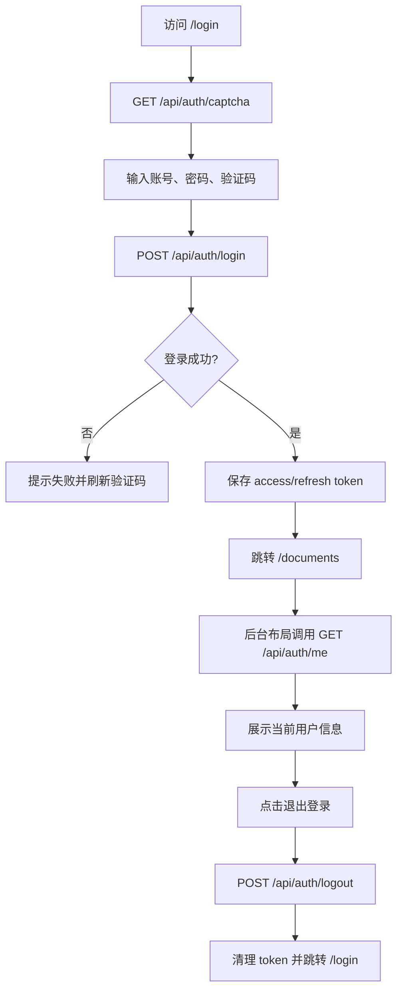

# 认证与路由守卫流程

## 功能目标
提供验证码登录、Token 保存、当前用户加载、路由鉴权和退出登录闭环。

## 参与角色
- 老师：登录后进入文档和题库工作台。
- 管理员：登录后进入系统配置等管理入口。
- 系统：校验验证码、账号密码、JWT 和 Redis 会话状态。

## 主流程
1. 前端访问 `/login`，调用 `GET /api/auth/captcha` 加载验证码。
2. 用户提交账号、密码、验证码，前端调用 `POST /api/auth/login`。
3. 后端校验验证码、限流、账号密码，签发 access token 和 refresh token。
4. 前端保存 token，跳转 `/documents`。
5. 后台布局加载时调用 `GET /api/auth/me` 展示当前用户信息。
6. 用户点击退出登录，前端调用 `POST /api/auth/logout`，清理本地 token 并跳转 `/login`。

## 异常流程
- 验证码错误、账号密码错误、限流触发：后端返回统一失败信息，前端提示并刷新验证码。
- 未登录访问业务路由：路由守卫跳转 `/login`。
- API 返回 `401`：前端清理 token 并跳转 `/login`。

## Mermaid 业务流程图

## 前后端交互点
- 页面：`/login`、后台布局、`/profile`。
- 接口：`GET /api/auth/captcha`、`POST /api/auth/login`、`GET /api/auth/me`、`POST /api/auth/logout`。
