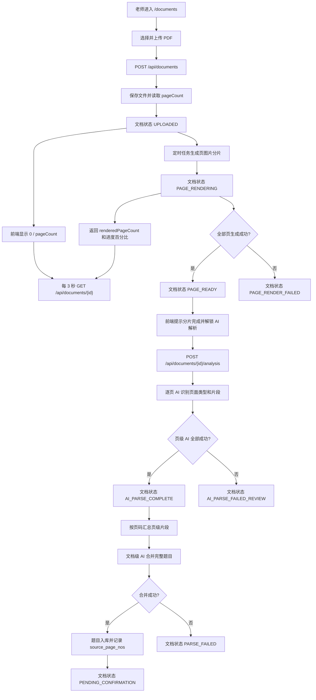

# 文档上传与 AI 解析流程

## 功能目标
老师上传 PDF 文档后，系统先在后台生成页级分片；前端按真实页数展示分片进度。分片完成并进入 `PAGE_READY` 后，老师可手动触发 AI 页级片段识别，系统再执行文档级二阶段合并，将跨页题干、答案和解析整理成完整题目并入库为待确认题目。

## 参与角色
- 老师：上传 PDF、查看真实分片进度、触发 AI 解析、查看解析结果。
- 系统：保存文件、读取总页数、渲染 PDF 页图片、识别页级片段、合并跨页题目、处理 raw_json 并写入题库。

## 主流程
1. 老师在 `/documents` 选择 PDF 文件并上传。
2. 前端调用 `POST /api/documents`，后端保存文件、读取 PDF 总页数并返回 `pageCount`，文档状态为 `UPLOADED`。
3. 前端显示 `0 / pageCount` 的真实进度条，并每 3 秒调用 `GET /api/documents/{id}` 查询最新状态、`renderedPageCount` 和 `renderProgressPercent`。
4. 后端定时任务扫描 `UPLOADED` 文档，将状态更新为 `PAGE_RENDERING`，逐页生成图片分片。
5. 前端持续展示 `renderedPageCount / pageCount`；全部页图片生成后，后端将文档状态更新为 `PAGE_READY`。
6. 前端提示“分片完成，可以发起 AI 解析”，并解锁“AI 解析”按钮。
7. 老师点击 AI 解析，前端调用 `POST /api/documents/{id}/analysis`。
8. 后端逐页调用 AI 识别页面类型和题目片段，并保存页级 raw_json；全部成功后文档进入 `AI_PARSE_COMPLETE`。
9. raw_json 后处理定时任务按页码汇总所有成功页片段，调用文档级 AI 合并跨页题干、答案和解析。
10. 合并后的完整题目写入题库，状态为 `PARSE_PENDING_CONFIRM`，题目来源记录 `source_page_nos`，文档进入 `PENDING_CONFIRMATION`。

## 异常流程
- 分片失败：文档进入 `PAGE_RENDER_FAILED`，前端显示失败提示并禁用 AI 解析按钮。
- 单页 AI 解析失败：文档进入 `AI_PARSE_FAILED_REVIEW`，老师可重试失败页或确认跳过。
- 答案解析页：页级 AI 标记为 `ANSWER_EXPLANATION`，二阶段合并时优先并入前一题，不单独入库。
- 无题页面：页级 AI 标记为 `NO_QUESTION`，允许空片段，不阻塞整篇文档。
- raw_json 后处理或二阶段合并失败：文档进入 `PARSE_FAILED`，系统记录错误并发送站内通知。
- 暂无最新分析记录：上传后分片开始前属于正常状态，前端只显示文档分片进度。

## Mermaid 业务流程图

## 前后端交互点
- 页面：`/documents`。
- 上传接口：`POST /api/documents`，返回 `pageCount`、`renderedPageCount`、`renderProgressPercent`。
- 进度轮询接口：`GET /api/documents/{id}`，每 3 秒查询最新状态和真实分片进度。
- 列表接口：`GET /api/documents`，返回每个文档的分片摘要。
- AI 解析接口：`POST /api/documents/{id}/analysis`，仅 `PAGE_READY` 或 `AI_PARSE_FAILED_REVIEW` 状态允许前端触发。
- 分析结果接口：`GET /api/documents/{id}/analysis/latest`。
- 内部 AI 协议：页级识别返回 `pageType + fragments`，文档级合并返回完整 `questions + sourcePageNos`。
