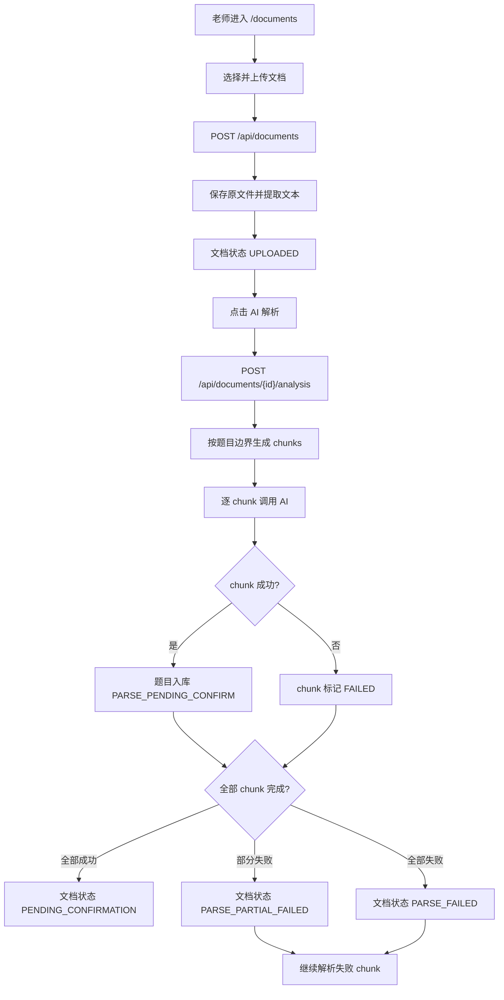

# 文档上传与 AI 解析流程

## 功能目标
老师上传文档后，手动触发 AI 解析；系统按题目边界分块、支持失败续跑，并将解析出的题目入库为待确认状态。

## 参与角色
- 老师：上传文档、触发 AI 解析、查看解析结果。
- 系统：保存文件、提取文本、按题目边界分块、调用 AI、写入题库。

## 主流程
1. 老师在 `/documents` 选择 `.md/.pdf/.doc/.docx` 文件并上传。
2. 前端调用 `POST /api/documents`，后端保存文件、提取文本，文档状态为 `UPLOADED`。
3. 老师点击 AI 解析，前端调用 `POST /api/documents/{id}/analysis`。
4. 后端按题目边界生成 chunk，逐块调用 AI。
5. chunk 成功后，题目写入题库，状态为 `PARSE_PENDING_CONFIRM`，并记录来源。
6. 所有 chunk 成功后，文档状态变为 `PENDING_CONFIRMATION`。

## 异常流程
- 单个 chunk 失败：其他 chunk 继续处理，文档最终进入 `PARSE_PARTIAL_FAILED`。
- 全部 chunk 失败：文档进入 `PARSE_FAILED`。
- 老师可对 `PARSE_PARTIAL_FAILED/PARSE_FAILED` 文档点击继续解析，只处理失败或未完成 chunk。
- oversized chunk 失败：前端提示建议人工拆分原文后重新上传。

## Mermaid 业务流程图

## 前后端交互点
- 页面：`/documents`。
- 接口：`POST /api/documents`、`GET /api/documents`、`GET /api/documents/{id}/content`、`POST /api/documents/{id}/analysis`、`GET /api/documents/{id}/analysis/latest`。
