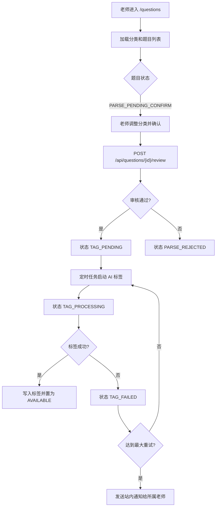

# 题目确认与 AI 标签流程

## 功能目标
老师从题库入口确认 AI 解析出的题目，确认后进入 AI 标签流程，标签完成后题目才可用。

## 参与角色
- 老师：查看自己的题库、调整分类、确认或驳回题目。
- 系统：控制题目状态机、执行 AI 标签分析、记录失败重试和通知。

## 主流程
1. 老师进入 `/questions` 查询自己的题库。
2. 前端调用 `GET /api/question-categories` 和 `GET /api/questions`。
3. 对 `PARSE_PENDING_CONFIRM` 题目，老师可调整分类后点击通过或驳回。
4. 通过时调用 `POST /api/questions/{id}/review`，题目流转到 `TAG_PENDING`。
5. 驳回时题目流转到 `PARSE_REJECTED`。
6. 定时任务对 `TAG_PENDING/TAG_FAILED` 题目执行 AI 标签分析。
7. 标签成功后题目进入 `AVAILABLE`，可用于后续检索和组卷。

## 异常流程
- 老师审核非本人题目：后端返回 `403`。
- 调整分类后与本人同分类同题干重复：后端拒绝审核。
- AI 标签失败：进入 `TAG_FAILED`；超过配置重试次数后通知题目所属老师。

## Mermaid 业务流程图

## 前后端交互点
- 页面：`/questions`。
- 接口：`GET /api/question-categories`、`GET /api/questions`、`POST /api/questions/{id}/review`。
