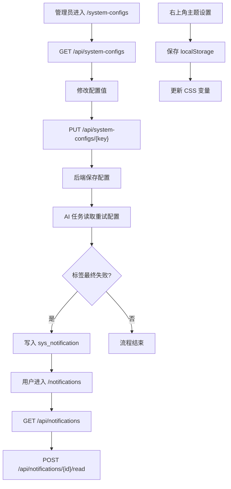

# 系统配置、主题与通知流程

## 功能目标
管理员维护系统配置；老师查看 AI 标签最终失败通知；用户可在前端切换主题配色。

## 参与角色
- 管理员：维护系统配置。
- 老师：接收和查看题目 AI 标签失败通知。
- 登录用户：切换前端主题、查看通知。
- 系统：读取配置控制 AI 重试次数，写入站内通知。

## 主流程
1. 管理员进入 `/system-configs`，前端调用 `GET /api/system-configs`。
2. 管理员修改配置后调用 `PUT /api/system-configs/{key}` 保存。
3. AI 文档解析或标签任务读取配置决定重试次数。
4. 题目标签达到最大重试次数后，系统写入站内通知。
5. 用户进入 `/notifications` 查看通知，调用 `POST /api/notifications/{id}/read` 标记已读。
6. 用户在右上角切换主题，前端保存到 `localStorage` 并更新 CSS 变量。

## 异常流程
- 无权限访问系统配置：后端返回 `403`，前端展示错误提示。
- 配置值非法：后端返回校验错误，前端提示。
- 通知标记已读失败：前端保留未读状态并提示错误。

## Mermaid 业务流程图

## 前后端交互点
- 页面：`/system-configs`、`/notifications`、后台右上角主题设置。
- 接口：`GET /api/system-configs`、`PUT /api/system-configs/{key}`、`GET /api/notifications`、`POST /api/notifications/{id}/read`。
- 本地状态：主题配色保存到 `localStorage`。
