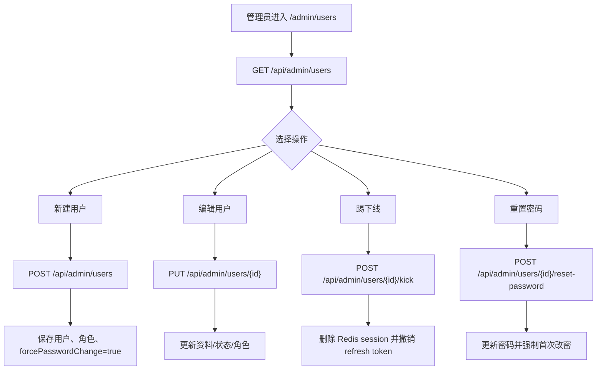

# 管理员用户管理流程

## 功能目标
管理员维护用户账号，支持新建用户、编辑资料与角色、禁用账号、踢用户下线和重置密码。

## 参与角色
- 管理员：执行用户管理操作。
- 系统：维护用户、角色关系、Redis 会话和 refresh token 状态。

## 主流程
1. 管理员进入 `/admin/users`，前端调用 `GET /api/admin/users` 加载用户列表。
2. 新建用户时调用 `POST /api/admin/users`，后端写入用户和角色关系，并设置 `forcePasswordChange=true`。
3. 编辑用户时调用 `PUT /api/admin/users/{id}`，后端更新昵称、状态、角色；禁用时撤销会话。
4. 踢用户下线时调用 `POST /api/admin/users/{id}/kick`，后端清理 Redis session 和 refresh token。
5. 重置密码时调用 `POST /api/admin/users/{id}/reset-password`，后端更新密码并设置首次改密。

## 异常流程
- 用户名重复：后端返回冲突错误。
- 角色不存在：后端拒绝保存。
- 普通用户访问：后端返回 `403`。

## Mermaid 业务流程图

## 前后端交互点
- 页面：`/admin/users`。
- 接口：`GET/POST/PUT/DELETE /api/admin/users`、`POST /api/admin/users/{id}/kick`、`POST /api/admin/users/{id}/reset-password`。
