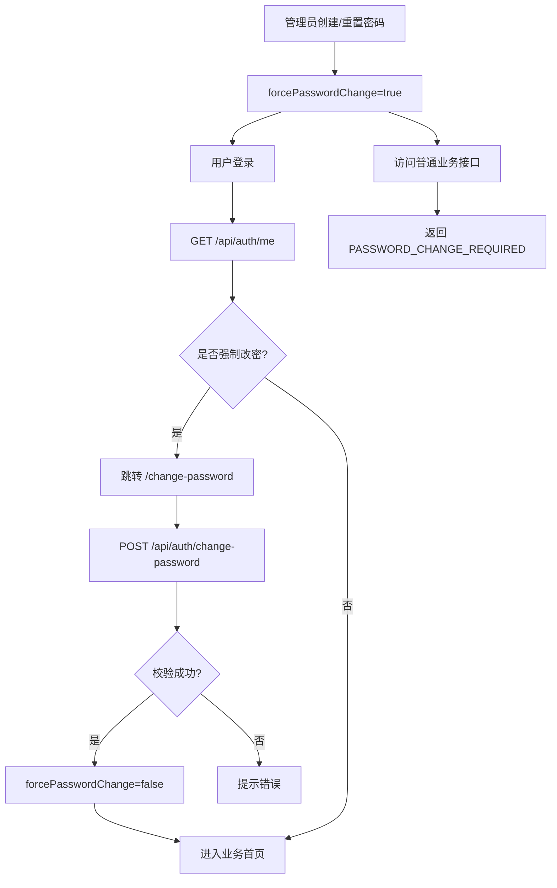

# 首次登录强制修改密码流程

## 功能目标
管理员创建或重置密码后的用户，首次登录必须修改密码，修改完成前不能访问其他业务功能。

## 参与角色
- 管理员：创建用户或重置用户密码。
- 用户：首次登录并修改密码。
- 系统：拦截未改密用户的业务请求。

## 主流程
1. 管理员创建用户或重置密码，后端设置 `forcePasswordChange=true`。
2. 用户登录成功后，前端调用 `GET /api/auth/me`。
3. 如果返回 `forcePasswordChange=true`，前端跳转 `/change-password`。
4. 用户提交原密码和新密码，前端调用 `POST /api/auth/change-password`。
5. 后端校验原密码，保存新密码，设置 `forcePasswordChange=false`。
6. 前端跳转业务首页。

## 异常流程
- 未改密用户访问普通接口：后端返回 `PASSWORD_CHANGE_REQUIRED`。
- 原密码错误或新密码与旧密码相同：后端拒绝。
- 用户可访问的例外接口：`/api/auth/me`、`/api/auth/logout`、`/api/auth/change-password`。

## Mermaid 业务流程图

## 前后端交互点
- 页面：`/change-password`、`/login`。
- 接口：`GET /api/auth/me`、`POST /api/auth/change-password`。
