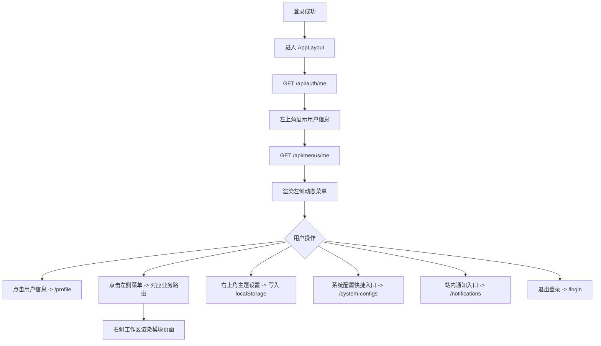

# 后台布局与导航流程

## 功能目标
提供左侧功能菜单、右侧工作区、用户详情入口和右上角系统设置区。

## 参与角色
- 登录用户：使用菜单切换业务页面。
- 系统：根据路由渲染对应功能模块。

## 主流程
1. 用户登录后进入后台布局。
2. 左上角展示当前用户昵称、账号和角色摘要。
3. 点击用户信息跳转 `/profile` 查看用户详情。
4. 左侧菜单调用 `GET /api/menus/me` 动态加载，并切换到对应业务路由。
5. 右侧工作区通过 `<router-view />` 渲染当前页面。
6. 右上角系统设置区支持主题切换、系统配置快捷入口、通知入口和退出登录。

## 异常流程
- 当前用户信息加载失败：前端提示错误；如果后端返回 `401`，统一回到登录页。
- 普通账号访问无权限页面：后端返回 `403`，前端展示错误提示。

## Mermaid 业务流程图

## 前后端交互点
- 页面：`AppLayout`、`/profile`、各业务路由。
- 接口：`GET /api/auth/me`、`GET /api/menus/me`、`POST /api/auth/logout`。
- 本地状态：主题配色保存到 `localStorage`。
