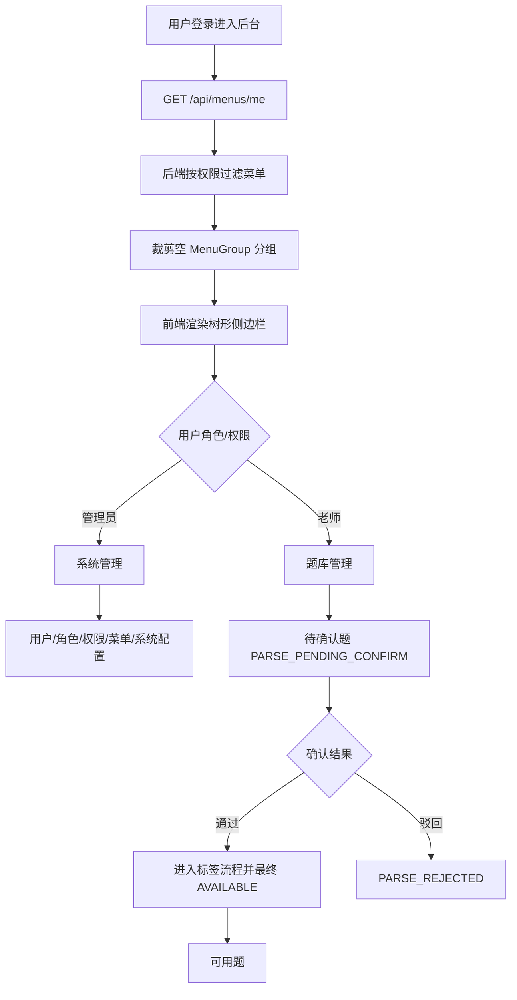

# 导航菜单分组与题库入口流程

## 功能目标

将后台导航按业务域分组：系统类管理入口统一收纳到“系统管理”，题目确认与可用题查看统一收纳到“题库管理”。老师上传文档解析出的题目先进入“待确认题”，确认通过后进入“可用题”。

## 参与角色

- 管理员：访问系统管理下的用户、角色、权限、菜单和系统配置入口，并维护菜单展示字段。
- 老师：访问题库管理下的可用题和待确认题入口，并确认或驳回解析题目。
- 无权限用户：只能看到自己拥有权限的菜单，不能看到空分组。

## 主流程

1. 用户登录后，前端调用 `GET /api/menus/me` 加载当前用户菜单树。
2. 后端按当前用户权限过滤菜单，并移除没有可见子菜单的分组。
3. `path = NULL` 的菜单作为分组只展开不跳转，叶子菜单按非空 `path` 跳转。
4. 前端侧边栏按 `children` 渲染一级分组和子菜单。
4. 管理员展开“系统管理”，进入系统类管理页面。
5. 老师展开“题库管理”，进入“待确认题”处理 `PARSE_PENDING_CONFIRM` 题目。
6. 老师确认通过后，题目进入后续标签流程，最终成为 `AVAILABLE` 并在“可用题”展示。

## 异常流程

- 当前用户没有分组下任一子菜单权限：后端不返回该空分组。
- 菜单接口加载失败：前端使用本地兜底菜单，保证基础导航可用。
- 待确认题审核失败：前端展示后端错误提示，题目仍保持原状态。
- 访问无权限页面：后端鉴权返回 `403`，前端保持当前会话。

## Mermaid 业务流程图

## 前后端交互点

- 菜单树：`GET /api/menus/me` 返回当前用户可见菜单树。
- 菜单管理：`GET /api/admin/menus` 查询完整菜单树，`PUT /api/admin/menus/{id}` 只维护菜单名称、图标、排序、状态和叶子菜单 `api_path`。
- API 路径选项：`GET /api/admin/menus/api-path-options` 扫描 Controller 根路径，供菜单绑定页面主资源 API。
- 可用题：`GET /api/questions?state=AVAILABLE`。
- 待确认题：`GET /api/questions?state=PARSE_PENDING_CONFIRM`。
- 审核题目：`POST /api/questions/{id}/review`。

## 相关接口与页面关系

- `/questions/available`：可用题页面，固定展示 `AVAILABLE` 状态题目。
- `/questions/pending-confirm`：待确认题页面，固定展示 `PARSE_PENDING_CONFIRM` 状态题目，并提供通过/驳回操作。
- `/questions`：兼容旧入口，重定向到 `/questions/available`。
- `/admin/users`、`/admin/roles`、`/admin/permissions`、`/admin/menus`、`/system-configs`：作为“系统管理”子菜单展示。
