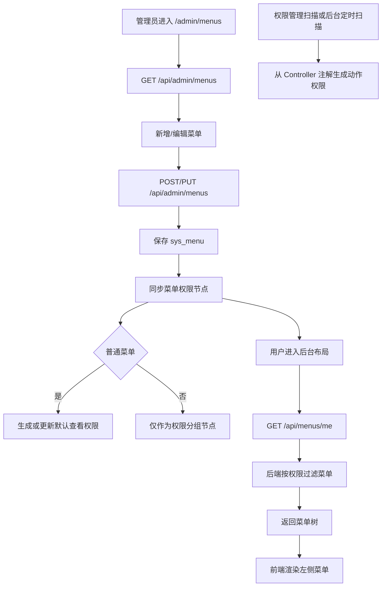

# 菜单管理与权限树联动流程

## 功能目标
管理员维护系统菜单，后端自动同步菜单权限树结构。新增普通菜单时自动生成对应菜单节点和默认“查看”权限，后台左侧菜单继续按当前用户权限过滤展示。

## 参与角色
- 管理员：维护菜单名称、路径、图标、排序、状态和权限码。
- 登录用户：根据自身权限看到可访问菜单。
- 系统：保存菜单、同步菜单权限节点和查看权限，并按权限过滤启用菜单。

## 主流程
1. 管理员进入 `/admin/menus`，前端调用 `GET /api/admin/menus`。
2. 管理员新增或编辑菜单，调用 `POST/PUT /api/admin/menus`。
3. 后端保存 `sys_menu`。
4. 后端为菜单同步权限树节点：分组菜单生成分组节点，普通菜单生成菜单节点。
5. 普通菜单默认生成“查看”权限；权限码优先复用菜单 `permissionCode`，为空时按菜单路径自动生成并回写。
6. 登录用户进入后台布局时，前端调用 `GET /api/menus/me`。
7. 后端根据用户权限过滤启用菜单，并移除没有可见子菜单的空分组。
8. 前端渲染左侧功能菜单。

## 异常流程
- 菜单存在子节点时删除父菜单：后端拒绝。
- 菜单接口失败：前端使用最小兜底菜单。
- 权限不足：对应菜单不会出现在当前用户菜单树中。
- 动作权限不随菜单手工创建：由权限管理中的“扫描权限”或后台 10 分钟定时扫描从 Controller 注解生成。

## Mermaid 业务流程图

## 前后端交互点
- 页面：`/admin/menus`、`/admin/permissions`、后台布局左侧菜单。
- 接口：`GET /api/menus/me`、`GET/POST/PUT/DELETE /api/admin/menus`、`POST /api/admin/permissions/scan`。
- 权限关系：菜单维护负责权限树结构和查看权限；权限扫描负责动作权限。
