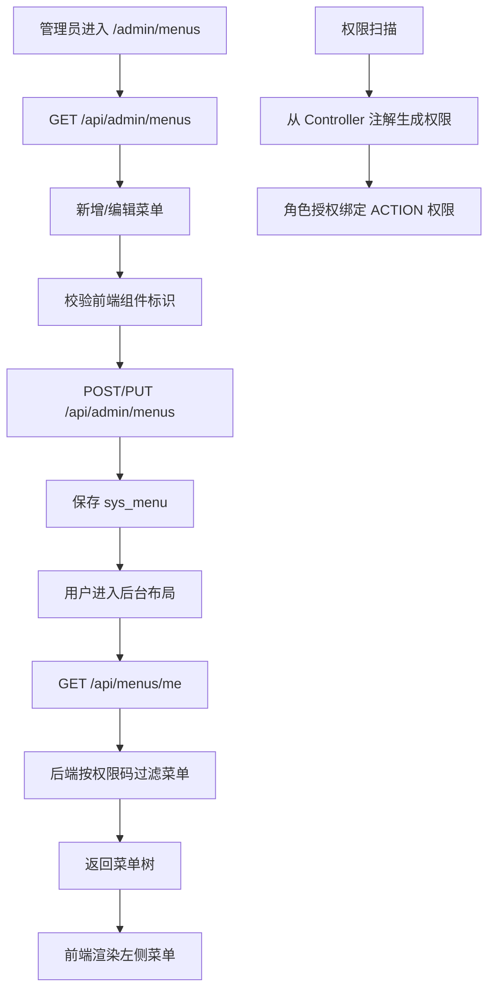

# 菜单管理与扫描权限联动流程

## 功能目标
管理员维护系统菜单，菜单仅保存前端路由、组件和可见性权限码。权限码必须绑定 Controller 扫描生成的动作权限，菜单管理不再创建菜单权限节点或默认查看权限。

## 参与角色
- 管理员：维护菜单名称、路径、图标、排序、状态和权限码。
- 登录用户：根据自身扫描权限看到可访问菜单。
- 系统：保存菜单，并按当前用户权限过滤启用菜单。

## 主流程
1. 管理员进入 `/admin/menus`，前端调用 `GET /api/admin/menus`。
2. 管理员新增或编辑菜单，前端校验组件标识必须存在于当前前端路由组件清单。
3. 后端保存 `sys_menu`，不会向 `sys_permission` 写入菜单节点或查看权限。
4. 系统启动、后台定时任务或管理员点击“扫描权限”时，从 Controller 注解全量同步权限。
5. 菜单 `permission_code` 绑定扫描生成的动作权限码，例如 `admin:menu:list`、`document:list`。
6. 登录用户进入后台布局时，前端调用 `GET /api/menus/me`。
7. 后端根据用户权限过滤启用菜单，并移除没有可见子菜单的空分组。
8. 前端渲染左侧功能菜单。

## 异常流程
- 菜单存在子节点时删除父菜单：后端拒绝。
- 菜单组件标识不存在：前端阻止提交。
- 菜单接口失败：前端使用最小兜底菜单。
- 权限不足：对应菜单不会出现在当前用户菜单树中。
- 菜单绑定了不存在或未授权的权限码：菜单不会对当前用户展示，需要管理员修正菜单配置或角色授权。

## Mermaid 业务流程图

## 前后端交互点
- 页面：`/admin/menus`、`/admin/permissions`、后台布局左侧菜单。
- 接口：`GET /api/menus/me`、`GET/POST/PUT/DELETE /api/admin/menus`、`POST /api/admin/permissions/scan`。
- 权限关系：菜单只消费扫描权限，不生产权限；`sys_permission` 的数据来源是 Controller 扫描。
