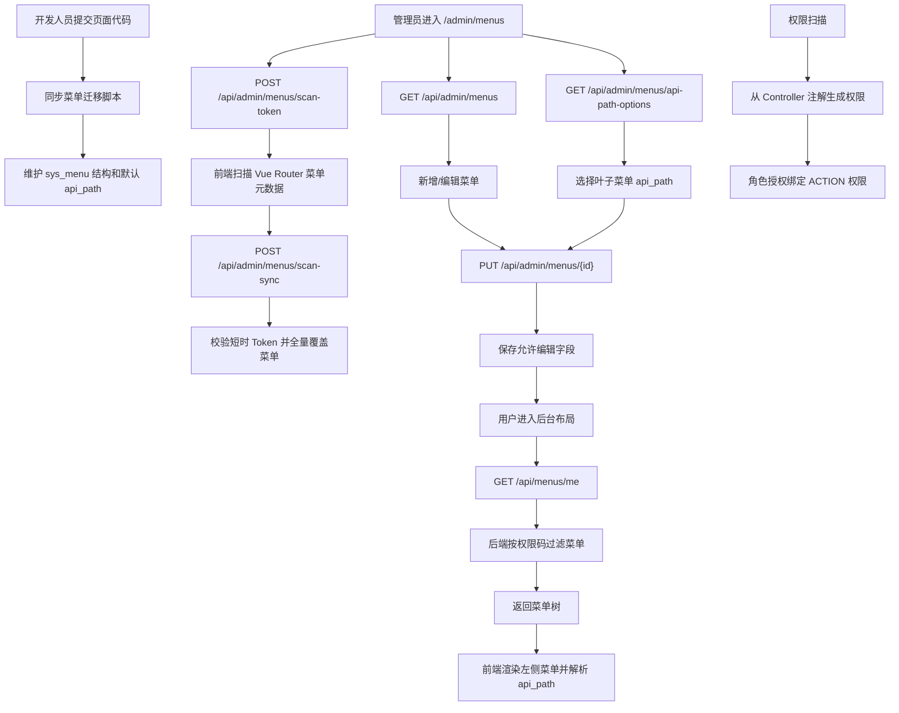

# 菜单管理与扫描权限联动流程

## 功能目标
核心内置菜单结构由开发人员通过迁移脚本维护，后台菜单管理允许管理员新增、编辑和删除扩展菜单。`sys_menu` 不保存前端组件标识，前端路由组件由代码路由表绑定；`path = NULL` 表示分组菜单，分组菜单不能设置 `api_path`。

## 参与角色
- 管理员：新增扩展菜单，维护菜单展示字段、叶子菜单 `path`、权限码和 `api_path`，删除没有子节点的菜单。
- 开发人员：通过可重复迁移脚本维护菜单结构、页面 `path`、权限码、图标初始值、排序初始值和默认 `api_path`。
- 登录用户：根据自身扫描权限看到可访问菜单。
- 系统：按当前用户权限过滤启用菜单，并移除没有可见子菜单的分组。

## 主流程
1. 开发人员新增或调整前端页面时，同步提交菜单迁移脚本。
2. 迁移脚本维护 `sys_menu`，其中 `path = NULL` 表示分组菜单，叶子菜单配置非空页面 `path`。
3. 管理员进入 `/admin/menus`，前端调用 `GET /api/admin/menus` 查询完整菜单树。
4. 前端调用 `GET /api/admin/menus/api-path-options`，下拉选项来自 Controller API 根路径扫描，名称取 `@Tag(name)`。
5. 管理员可新建根菜单或子菜单；分组菜单不填写 `path`，叶子菜单填写页面 `path`、权限码并可选择 `api_path`。
6. 管理员可编辑菜单名称、图标、排序、状态；叶子菜单可从下拉中选择 `api_path`，分组菜单不能设置 `api_path`。
7. ADMIN 点击“扫描菜单”时，前端先调用 `POST /api/admin/menus/scan-token` 获取短时 Token；同一用户会话 5 分钟内最多获取 1 次。
8. 前端扫描自身 Vue Router 菜单元数据，随后调用 `POST /api/admin/menus/scan-sync`，通过 `X-Menu-Scan-Token` 请求头提交短时 Token 和菜单树。
9. 后端校验 JWT、ADMIN 角色、`admin:menu:scan` 权限和短时 Token，Token 校验成功后立即作废，并以本次前端扫描结果全量覆盖菜单表。
10. 扫描同步会新增缺失菜单、覆盖更新已存在菜单，并逻辑删除本次扫描结果中不存在的旧菜单。
11. 系统启动、后台定时任务或管理员点击“扫描权限”时，从 Controller 注解全量同步权限。
12. 权限扫描以 Controller 类级 `@RequestMapping` 根路径反查菜单 `api_path`，命中后使用菜单名称作为权限分组名称；同一 `api_path` 绑定多个菜单时使用 `/` 合并菜单名称，未命中时回退到 `@Tag(name)`。
13. 菜单 `permission_code` 绑定扫描生成的动作权限码，例如 `admin:menu:list`、`document:list`。
14. 登录用户进入后台布局时，前端调用 `GET /api/menus/me`。
15. 后端根据用户权限过滤启用菜单，并移除没有可见子菜单的空分组。
16. 前端渲染左侧菜单；分组只展开不跳转，叶子菜单按 `path` 跳转，页面请求优先使用菜单 `api_path`。

## 异常流程
- 管理员给分组菜单提交 `api_path`：后端返回业务异常，前端保存失败。
- 管理员删除仍有子菜单的菜单：后端返回业务异常，要求先删除或迁移子菜单。
- 管理员新增重复页面 `path`：后端返回业务异常，避免同一路由出现多个叶子菜单。
- 管理员 5 分钟内重复获取菜单扫描短时 Token：后端返回限流异常，前端提示稍后再试。
- 菜单扫描同步缺少 Token、Token 过期、Token 错误或重复使用：后端拒绝同步，前端提示重新扫描。
- 菜单扫描结果不包含旧菜单：后端逻辑删除旧菜单，前端刷新后不再展示该菜单。
- 菜单接口失败：前端使用最小兜底菜单和默认 API 路径，保证基础导航可用。
- 权限不足：对应叶子菜单不会出现在当前用户菜单树中；分组没有可见子菜单时一并隐藏。
- 菜单绑定了不存在或未授权的权限码：菜单不会对当前用户展示，需要通过迁移脚本修正权限码或在角色授权中补齐。

## Mermaid 业务流程图

## 前后端交互点
- 页面：`/admin/menus`、`/admin/permissions`、后台布局左侧菜单。
- 接口：`GET /api/menus/me`、`GET /api/admin/menus`、`POST /api/admin/menus`、`PUT /api/admin/menus/{id}`、`DELETE /api/admin/menus/{id}`、`GET /api/admin/menus/api-path-options`、`POST /api/admin/menus/scan-token`、`POST /api/admin/menus/scan-sync`、`POST /api/admin/permissions/scan`。
- 权限关系：菜单只消费扫描权限，不生产权限；`sys_permission` 的数据来源是 Controller 扫描。
- 扫描安全：菜单扫描同步必须使用短时 Token，Token 默认有效 30 秒、最长 180 秒，同一用户会话 5 分钟内最多获取 1 次。
- 同步语义：前端 Vue Router 扫描结果是菜单表权威来源；同步时新增缺失菜单、覆盖已有菜单字段，并逻辑删除未扫描到的旧菜单。
- 分组命名：权限扫描用 Controller 根路径匹配菜单 `api_path`，菜单存在时权限分组名称跟随菜单名称，菜单缺失时使用 Controller `@Tag(name)`。
- 数据关系：`path = NULL` 是分组菜单判定规则；叶子菜单通过 `api_path` 绑定页面主资源 API 根路径。
