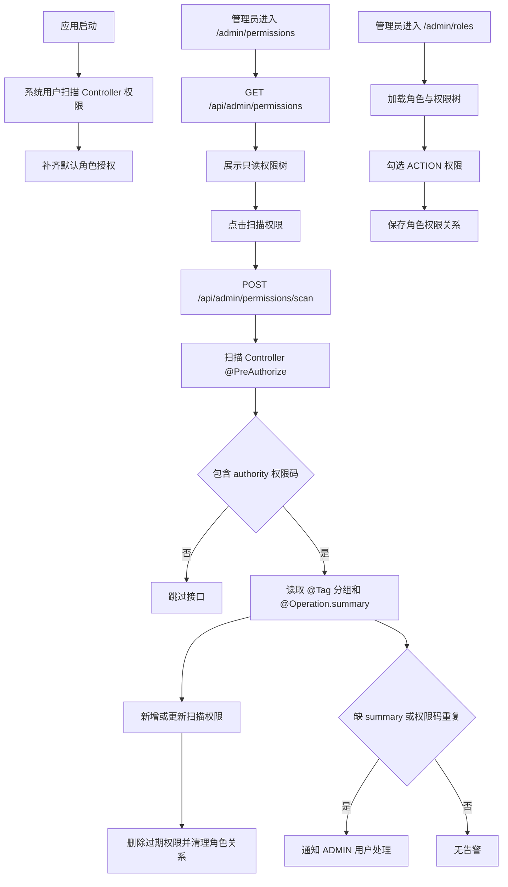

# 角色与 Controller 扫描权限管理流程

## 功能目标
管理员以树形结构查看 Controller 扫描生成的权限，并通过角色编辑弹窗分配动作权限。权限数据只能由 Controller 的 `@PreAuthorize` 表达式扫描生成，权限名称来自接口 `@Operation(summary)`。

## 参与角色
- 管理员：扫描权限、查看权限树、处理扫描告警、为角色分配权限。
- 系统：启动和定时扫描 Controller 权限、全量同步权限表、清理过期授权关系、发送站内告警。

## 主流程
1. 系统启动后以用户权限模块系统用户立即扫描 Controller 权限，并补齐 ADMIN/TEACHER/STUDENT 默认角色授权。
2. 管理员进入 `/admin/permissions`，前端调用 `GET /api/admin/permissions` 加载只读权限树。
3. 管理员点击“扫描权限”，前端调用 `POST /api/admin/permissions/scan` 触发全量同步。
4. 后端只提取 Controller 方法 `hasAuthority` 和 `hasAnyAuthority` 中的权限码。
5. 后端按 Controller `@Tag(name)` 生成分组，按接口 `@Operation(summary)` 生成权限名称。
6. 同一权限码出现在多个接口时，权限名称按扫描顺序去重并用 `/` 合并。
7. 本次扫描不存在的权限会被逻辑删除，并同步清理 `sys_role_permission`。
8. 管理员进入 `/admin/roles` 编辑角色，后端只允许保存扫描生成的 ACTION 权限。

## 异常流程
- Controller 接口没有设置 `hasAuthority` 或 `hasAnyAuthority`：扫描时跳过。
- 接口缺少 `@Operation.summary`：使用 `HTTP_METHOD path` 作为名称片段，并发送站内通知给 ADMIN 用户。
- 同一权限码多次出现：继续扫描并合并权限名称，同时发送站内通知给 ADMIN 用户。
- 尝试分配分组节点或历史非 ACTION 权限：后端拒绝保存。
- 非管理员或权限不足访问：后端返回 `403`。

## Mermaid 业务流程图

## 前后端交互点
- 页面：`/admin/permissions`、`/admin/roles`、`/notifications`。
- 接口：`GET /api/admin/permissions`、`POST /api/admin/permissions/scan`、`GET/POST/PUT/DELETE /api/admin/roles`、`GET /api/notifications`。
- 数据关系：`sys_permission` 只保存 Controller 扫描生成的分组和动作权限；`sys_menu.permission_code` 只能绑定扫描生成的动作权限码。
