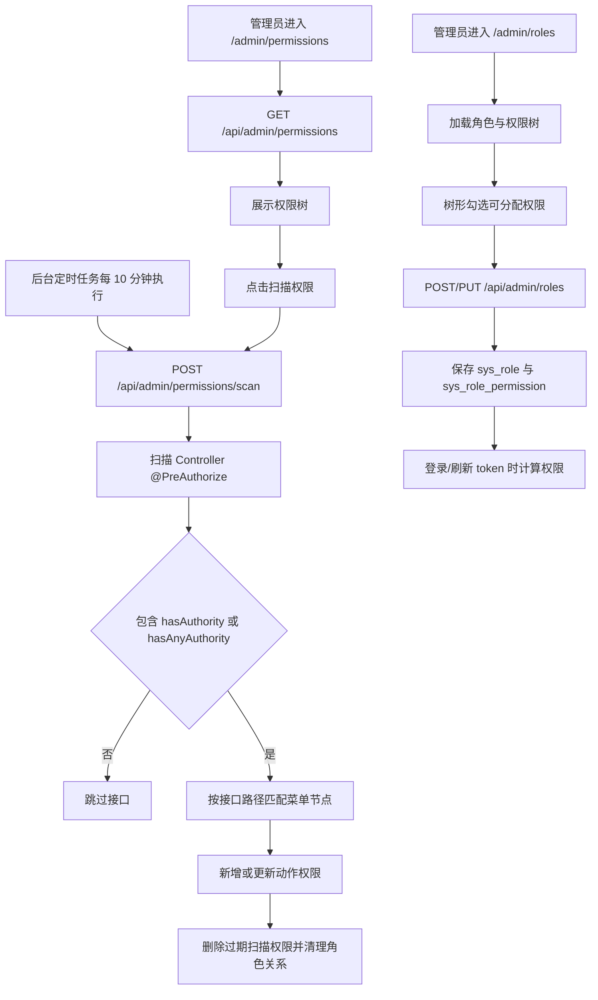

# 角色与权限树管理流程

## 功能目标
管理员以树形结构查看权限，并通过角色编辑弹窗按树勾选可分配权限。动作权限由“扫描权限”从 Controller 的 `@PreAuthorize` 中自动生成，避免权限码和接口注解脱节。

## 参与角色
- 管理员：扫描权限、查看权限树、为角色分配权限。
- 系统：维护菜单权限树、扫描接口权限、保存角色权限关系，并在登录和鉴权时计算用户权限。

## 主流程
1. 系统启动后等待 `app.permission.scan-initial-delay`，后台定时任务开始扫描 Controller 权限，默认每 10 分钟执行一次。
2. 管理员进入 `/admin/permissions`，前端调用 `GET /api/admin/permissions` 加载权限树。
3. 管理员也可以点击“扫描权限”，前端调用 `POST /api/admin/permissions/scan` 立即触发一次扫描。
4. 后端扫描所有 Controller 方法，只提取 `hasAuthority` 和 `hasAnyAuthority` 中的权限码。
5. 后端按接口路径匹配菜单节点，创建或更新动作权限；未匹配到菜单的权限放入“未归类权限”。
6. 后端自动删除已经不在 Controller 权限注解中的扫描来源动作权限，并清理角色权限关系。
7. 管理员进入 `/admin/roles` 新建或编辑角色，前端加载权限树并用树形勾选权限。
8. 后端保存 `sys_role` 和 `sys_role_permission`，登录或刷新 token 时重新计算权限。

## 异常流程
- Controller 接口没有设置 `hasAuthority` 或 `hasAnyAuthority`：扫描时跳过。
- 权限码或角色编码重复：后端返回冲突错误。
- 尝试把菜单分组节点分配给角色：后端拒绝保存。
- 非管理员或权限不足访问：后端返回 `403`。

## Mermaid 业务流程图

## 前后端交互点
- 页面：`/admin/permissions`、`/admin/roles`。
- 接口：`GET /api/admin/permissions`、`POST /api/admin/permissions/scan`、`GET/POST/PUT/DELETE /api/admin/roles`。
- 数据关系：菜单维护负责生成菜单节点和查看权限；扫描权限负责生成 Controller 动作权限。
