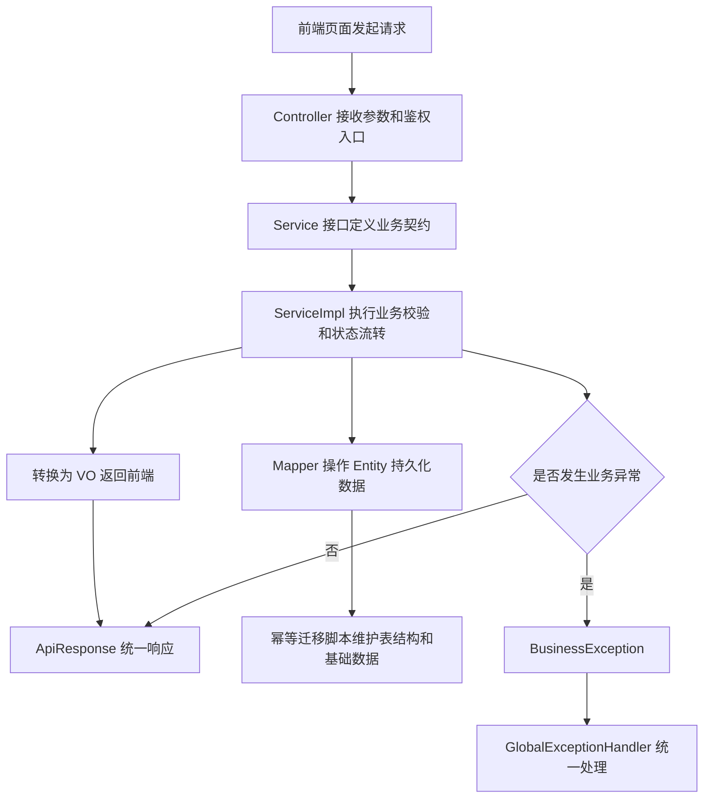

# 代码规范治理说明

## 功能目标

本次治理用于将项目代码继续整理到 `AGENTS.md` 约定的工程规范下，重点覆盖后端分层结构、前端返回对象 VO 归位、迁移脚本可重复执行、代码注释与业务文档补齐。

## 参与角色

- 管理员：使用用户、角色、菜单、权限、系统配置等后台页面。
- 普通用户：使用登录、改密、文档上传解析、题目确认等业务页面。
- 后端服务：负责鉴权、业务校验、状态流转、数据持久化和统一返回。
- 前端页面：通过 API 获取 VO 数据并渲染中后台交互。

## 主流程

1. 后端 Controller 接收请求并使用统一返回对象封装响应。
2. Controller 只做参数接收、鉴权入口和服务编排，业务逻辑进入 Service 接口与 `service/impl` 实现。
3. Service 实现完成参数校验、业务状态流转、事务控制和 Mapper 数据访问。
4. Mapper 基于 MyBatis-Plus 操作 Entity，面向前端的数据统一转换为 `vo` 包对象。
5. 前端模块通过统一 API 获取 VO 数据，表单提交使用 DTO 对应的请求结构。
6. 数据库迁移脚本使用存在性判断、幂等插入或幂等更新，支持重复执行。

## 异常流程

- 参数非法、资源不存在或状态不允许继续处理时，Service 抛出 `BusinessException`。
- 未登录、无权限和服务器异常由全局异常处理器统一转换为标准响应。
- AI 解析分片失败时，后端记录失败分片、错误信息和原始响应，不中断其他分片汇总。
- 定时任务内部捕获异常并记录日志，避免单次失败影响后续调度。

## Mermaid 业务流程图

## 前后端交互点

- 登录、注册、刷新、改密接口返回 `auth/vo` 下的前端视图对象。
- 文档上传、解析进度和题目解析结果返回 `document/vo` 下的视图对象。
- 题库分类、题目详情和审核结果返回 `question/vo` 下的视图对象。
- 系统配置和通知返回 `system/vo` 下的视图对象。
- 用户、角色、菜单、权限管理返回 `user/vo` 下的视图对象。

## 相关接口与页面关系

- `AuthController` 对应登录、注册、改密和个人信息页面。
- `DocumentController` 对应文档上传与 AI 解析页面。
- `QuestionBankController` 对应待确认题目和可用题库页面。
- `SystemConfigController`、`NotificationController` 对应系统配置和通知页面。
- `AdminUserController`、`AdminRoleController`、`AdminMenuController`、`AdminPermissionController` 对应后台管理页面。

## 注释与文档约束

- 后端类、接口、枚举、构造器和方法必须提供 Javadoc，说明用途、参数、返回值和重要业务异常。
- 关键业务分支需要行内注释说明业务意图，例如令牌轮换、分片重试、题目去重和状态机流转。
- 新增功能或治理动作需要同步补充 `docs/` 下的 Markdown 文档，并使用 Mermaid 描述主流程。
