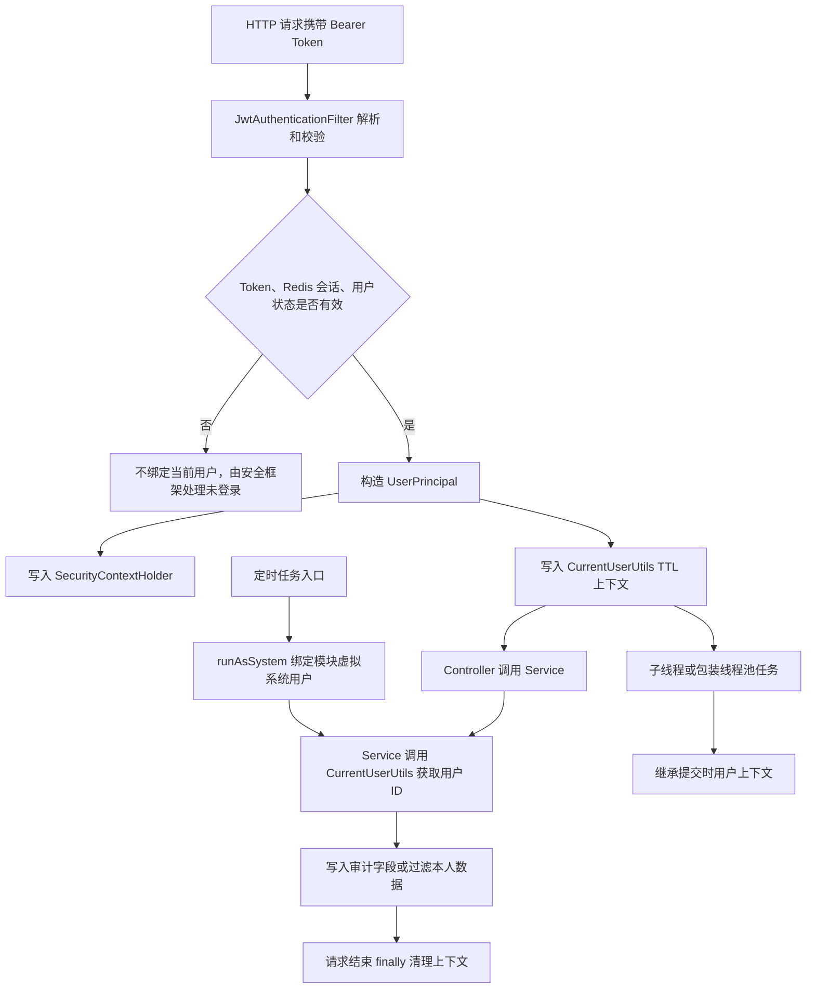

# 当前用户上下文传播流程

## 功能目标

为后端提供统一当前用户上下文工具，让 Controller、Service、过滤器、子线程和定时任务都能通过同一入口获取当前用户信息，并支持审计字段记录当前操作人。

## 参与角色

- 登录用户：通过 JWT 请求后端接口，用户信息进入当前线程上下文。
- 子线程任务：由登录用户上下文启动，继承提交时的用户信息。
- 定时任务：无登录用户时绑定模块级虚拟系统用户。
- 后端服务：通过 `CurrentUserUtils` 获取当前用户 ID、用户名、角色和权限。

## 主流程

1. 请求进入 `JwtAuthenticationFilter`。
2. 过滤器解析 JWT、校验 Redis 会话和用户状态。
3. 校验通过后，过滤器写入 `SecurityContextHolder` 和 `CurrentUserUtils`。
4. Controller 不再显式接收或下传 `UserPrincipal`。
5. Service 在需要审计、鉴权或过滤数据时调用 `CurrentUserUtils`。
6. 请求结束后，过滤器清理当前线程上下文，避免线程复用污染。

## 异常流程

- 当前线程没有登录用户或系统用户时，`requireCurrentUser()` 抛出未登录业务异常。
- JWT 无效或会话不匹配时，不写入当前用户上下文，后续由 Spring Security 统一拦截。
- 定时任务执行失败时保留原有日志捕获，不影响下一次调度。
- 第三方未包装线程池不会自动传播上下文，新增异步任务应使用项目统一执行器或 `CurrentUserUtils.wrap(...)`。

## Mermaid 业务流程图

## 前后端交互点

- 前端请求方式不变，仍通过 `Authorization: Bearer token` 传递访问令牌。
- 后端接口返回结构不变，仍使用统一 `ApiResponse` 和各模块 VO。
- 本次改造不新增前端页面或接口字段，只调整后端内部获取当前用户的方式。

## 相关接口与页面关系

- 登录、菜单、文档、题库、通知、系统配置等页面调用原有接口。
- 后端接口无需再把 `UserPrincipal` 从 Controller 层传递到 Service 层。
- 定时任务涉及题目 AI 标签和权限扫描，分别使用题库模块和用户权限模块虚拟系统用户。
