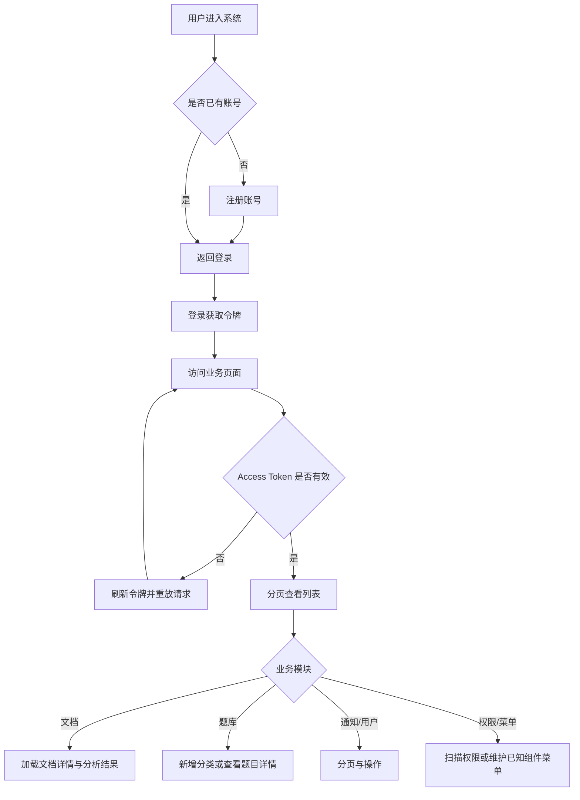

# 功能闭环补齐流程

## 功能目标
补齐认证续期、注册、分页、题目分类、题目详情、文档详情、权限扫描、菜单组件约束和主动修改密码入口，确保后端已有能力在前端具备对应页面、入口、交互和异常处理。

## 参与角色
- 学生：注册账号、登录系统、查看个人信息、修改密码。
- 教师：上传文档、查看文档详情、触发 AI 分析、查看题目、维护题目分类、审核待确认题。
- 管理员：维护用户、角色、权限、菜单和系统配置。

## 主流程
1. 用户可在登录页进入注册页，提交账号、昵称和密码后返回登录页。
2. 登录后访问接口时，如果 access token 过期，前端使用 refresh token 自动续期并重放原请求。
3. 文档、题目、通知和用户列表通过分页控件切换页码和每页数量。
4. 教师在题库页新增分类，随后分类下拉刷新并可用于题目筛选。
5. 教师在题目列表或待确认列表打开详情弹窗，查看完整题干、选项、答案、解析和标签信息。
6. 教师选择文档时加载文档详情和最新分析摘要，再按需查看文本预览或触发分析。
7. 管理员在权限管理页扫描 Controller 权限，角色授权树可继续分配扫描生成的动作权限。
8. 管理员维护菜单时只能选择当前前端已存在的组件标识，避免新增不可访问菜单。
9. 登录用户可从账号菜单进入修改密码页。

## 异常流程
- 注册失败时保留当前表单并展示错误信息。
- refresh token 失效或刷新失败时清理本地登录态并跳转登录页。
- 分页、详情、分类新增、权限扫描失败时使用 Element Plus 消息提示，不破坏当前页面状态。
- 菜单组件标识非法时前端阻止提交，并提示选择已有组件。

## Mermaid 业务流程图

## 前后端交互点
- 认证：`/api/auth/register`、`/api/auth/login`、`/api/auth/refresh`、`/api/auth/change-password`。
- 文档：`/api/documents`、`/api/documents/{id}`、`/api/documents/{id}/content`、`/api/documents/{id}/analysis/latest`。
- 题库：`/api/question-categories`、`/api/questions`、`/api/questions/{id}`、`/api/questions/{id}/review`。
- 通知：`/api/notifications`、`/api/notifications/{id}/read`。
- 后台：`/api/admin/users`、`/api/admin/permissions`、`/api/admin/menus`。

## 相关接口与页面关系
- `RegisterPage.vue` 对应注册接口，`LoginPage.vue` 提供入口。
- `http.js` 统一处理 access token 过期后的 refresh 与请求重放。
- `DocumentsPage.vue` 对应文档分页、详情、内容和分析接口。
- `AvailableQuestionsPage.vue` 与 `PendingConfirmQuestionsPage.vue` 对应题目分页、详情、分类和审核接口。
- `NotificationsPage.vue` 与 `AdminUsersPage.vue` 对应分页列表。
- `AdminPermissionsPage.vue` 对应权限树查看和 Controller 权限扫描。
- `AdminMenusPage.vue` 对应菜单维护，并约束组件标识必须匹配现有前端路由组件。
