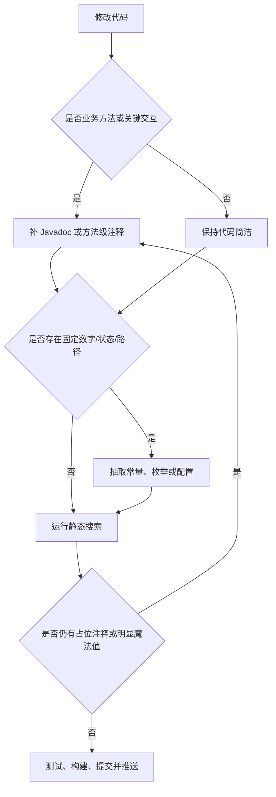

# 代码注释与常量治理流程

## 功能目标
规范前后端代码注释、Javadoc 和业务常量管理，减少占位式注释与散落魔法值，保证后续功能在开发时能说明业务意图、关键参数、返回值和异常分支。

## 参与角色
- 后端开发：为 Controller、Service、工具类和关键私有方法编写真正描述业务规则的 Javadoc。
- 前端开发：为页面加载、提交、分页、弹窗初始化和请求层续期等关键方法添加业务注释。
- 管理员与教师：通过更清晰的业务代码和文档获得稳定、可维护的功能闭环。

## 主流程
1. 编写或修改方法前，先判断该方法是否属于业务入口、业务状态流转、外部依赖调用或数据转换。
2. 后端方法使用 Javadoc 说明方法用途、关键参数、返回值和重要异常分支。
3. 前端页面方法使用方法级注释说明交互目的，例如分页重置、详情加载、弹窗草稿初始化和令牌续期。
4. 关键逻辑内部补充简短注释，说明业务决策原因，例如权限扫描归类、题目去重、Token 刷新重放和文件上传 Content-Type 处理。
5. 业务数字、状态值、路径白名单和固定候选项统一抽取为常量、枚举或配置项。
6. 提交前使用静态搜索检查占位式注释、魔法值和缺失文档。

## 异常流程
- 如果方法只是简单 getter、DTO record 或纯 API 封装，可使用类级说明或集中常量说明，避免重复无意义注释。
- 如果魔法值来自 UI 尺寸或 Element Plus 布局宽度，应优先通过样式变量或页面常量维护；纯样式数值可在 scoped CSS 中保留。
- 如果正则表达式、SQL 片段或协议字段必须保留字面量，需要用常量名或相邻注释说明用途。

## Mermaid 业务流程图

## 前后端交互点
- 后端认证接口说明限流、Cookie 写入、刷新令牌轮换和异常分支。
- 后端文档接口说明上传、详情、文本预览和 AI 分析状态限制。
- 后端题库服务说明 AI 入库去重、分类标准化、状态机审核和标签失败通知。
- 前端请求层说明 401 自动续期、并发刷新复用和请求重放。
- 前端列表页说明分页重置、详情加载、弹窗初始化和提交后的刷新策略。

## 相关接口与页面关系
- `AuthController` 对应登录、注册、刷新、退出、改密和当前用户页面。
- `DocumentController` 与 `DocumentsPage.vue` 对应文档上传、详情、文本预览和分析。
- `QuestionBankServiceImpl` 与题库页面对应分类、题目列表、详情和审核。
- `AdminPermissionServiceImpl` 与权限页面对应权限扫描、权限新增和权限树维护。
- `frontend/src/shared/constants.js` 统一维护前端分页、校验、状态和菜单组件候选常量。
