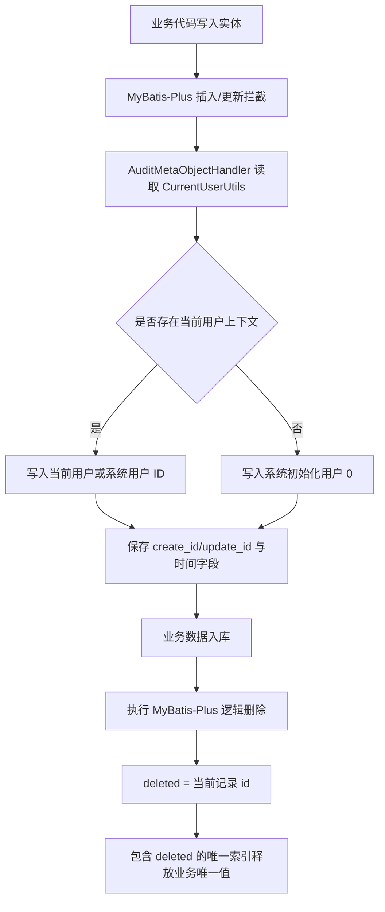

# 基础实体与逻辑删除改造流程

## 功能目标

统一后端所有数据库实体的公共字段，所有 `@TableName` 实体继承 `BaseEntity`，由 MyBatis-Plus 自动维护 `id`、`create_id`、`create_time`、`update_id`、`update_time`、`deleted`。逻辑删除字段 `deleted` 未删除为 `0`，删除时写入当前记录 `id`，配合唯一索引中的 `deleted` 字段解决逻辑删除后业务唯一值无法复用的问题。

## 参与角色

- 登录用户：发起新增、更新、删除等业务操作，审计字段记录当前用户 ID。
- 系统用户：定时任务通过 `CurrentUserUtils.runAsSystem(...)` 绑定模块系统用户，审计字段记录固定负数系统用户 ID。
- 公开入口：注册等无登录上下文入口由自动填充器写入 `0`，表示系统初始化来源。

## 主流程

1. 业务代码创建或更新实体。
2. MyBatis-Plus 执行插入或更新前触发 `AuditMetaObjectHandler`。
3. 自动填充器从 `CurrentUserUtils` 读取当前用户，写入创建人与更新人字段。
4. 删除实体时，MyBatis-Plus 按全局逻辑删除配置生成逻辑删除 SQL。
5. `deleted` 从 `0` 更新为当前记录 `id`。
6. 后续新增相同业务唯一值时，由包含 `deleted` 的唯一索引允许新活动记录写入。

## 异常流程

- 当前用户上下文不存在：自动填充器写入 `0`，用于注册、初始化等公开入口，避免审计填充阻断主流程。
- 历史表缺少公共字段：迁移脚本通过存在性判断补齐字段，重复执行不会重复加列。
- 历史唯一索引不包含 `deleted`：迁移脚本重建唯一索引，确保活动数据仍唯一、已删除数据不阻塞新数据。
- 业务代码手写删除 SQL：不符合规范，必须改为 MyBatis-Plus 删除能力，避免跳过全局逻辑删除配置。

## Mermaid 业务流程图

## 前后端交互点

- 本次改造不改变前端接口字段；VO 仍按原有 `createdAt`、`updatedAt`、`uploadedBy` 等展示字段返回。
- 后端实体字段从历史 `created_at/updated_at/created_by/updated_by` 迁移到 `create_time/update_time/create_id/update_id`，前端无感知。

## 相关接口与页面关系

- 认证、用户、角色、权限、菜单、文档、题库、系统配置、通知等现有接口均受统一审计字段与逻辑删除配置保护。
- 前端页面无需调整菜单或按钮；本次属于后端实体与数据库一致性改造。
