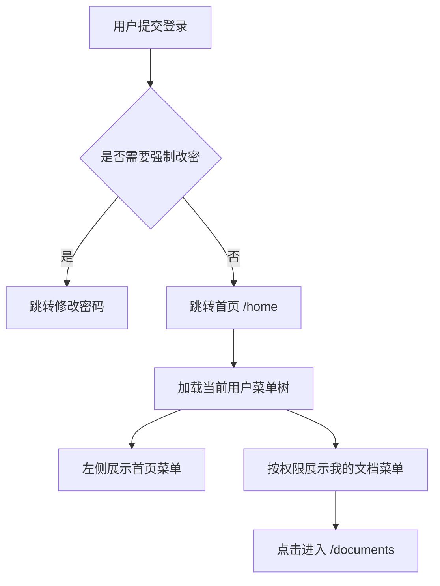

# 首页菜单流程

## 功能目标
登录后默认进入首页菜单；左侧菜单区展示“首页”和“我的文档”，首页作为工作台入口，“我的文档”继续进入文档分析页面。

## 参与角色
- ADMIN：可访问首页，并按权限访问后台菜单。
- TEACHER：可访问首页，并按权限访问文档和题库菜单。
- STUDENT：可访问首页，并按权限访问被授权菜单。

## 主流程
1. 用户登录成功。
2. 前端保存访问令牌和刷新令牌。
3. 如用户不需要强制修改密码，默认跳转 `/home`。
4. 布局加载当前用户菜单树。
5. 左侧菜单展示“首页”和用户可见的业务菜单。
6. 用户点击“我的文档”进入 `/documents`。

## 异常流程
- 用户需要强制修改密码时，登录后优先跳转 `/change-password`。
- 菜单接口加载失败时，前端使用兜底菜单展示“首页”“我的文档”等基础入口。
- 用户没有 `document:list` 权限时，后端菜单裁剪不会返回“我的文档”菜单。

## 业务流程图

## 前后端交互点
- `POST /api/auth/login`：登录并签发令牌。
- `GET /api/auth/me`：首页展示当前用户概要。
- `GET /api/menus/me`：加载左侧菜单树。
- `GET /api/documents`：进入“我的文档”后加载文档列表。

## 页面与菜单关系
- 首页：`/home`，菜单名“首页”，无主资源 API。
- 我的文档：`/documents`，菜单名“我的文档”，主资源 API 为 `/api/documents`。
